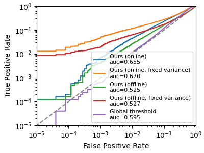
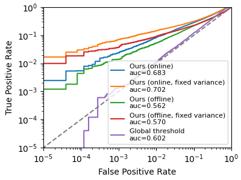

# Likelihood Ration Attack (LiRA) in PyTorch
Implementation of the original [LiRA](https://github.com/tensorflow/privacy/tree/master/research/mi_lira_2021) using PyTorch. To run the code, first create an environment with the `env.yml` file. Then run the following command to train the models and run the LiRA attack:

```
./run.sh
```

The output will generate and store a log-scale FPR-TPR curve as `./fprtpr.png` with the TPR@0.1%FPR in the output log.

## Results on CIFAR10

Using 16 shadow models trained with `ResNet18 and 2 augmented queries`:


```
Attack Ours (online)
   AUC 0.6548, Accuracy 0.6015, TPR@0.1%FPR of 0.0068
Attack Ours (online, fixed variance)
   AUC 0.6700, Accuracy 0.6042, TPR@0.1%FPR of 0.0464
Attack Ours (offline)
   AUC 0.5250, Accuracy 0.5353, TPR@0.1%FPR of 0.0041
Attack Ours (offline, fixed variance)
   AUC 0.5270, Accuracy 0.5380, TPR@0.1%FPR of 0.0192
Attack Global threshold
   AUC 0.5948, Accuracy 0.5869, TPR@0.1%FPR of 0.0006
```

Using 16 shadow models trained with `WideResNet28-10 and 2 augmented queries`:


```
Attack Ours (online)
   AUC 0.6834, Accuracy 0.6152, TPR@0.1%FPR of 0.0240
Attack Ours (online, fixed variance)
   AUC 0.7017, Accuracy 0.6240, TPR@0.1%FPR of 0.0704
Attack Ours (offline)
   AUC 0.5621, Accuracy 0.5649, TPR@0.1%FPR of 0.0140
Attack Ours (offline, fixed variance)
   AUC 0.5698, Accuracy 0.5628, TPR@0.1%FPR of 0.0370
Attack Global threshold
   AUC 0.6016, Accuracy 0.5977, TPR@0.1%FPR of 0.0013
```